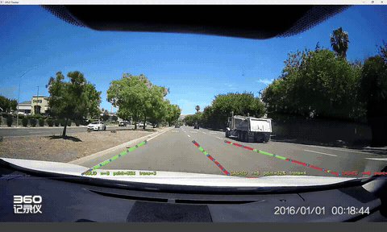

# LaneSense

A dashcam-based lane detection and highway navigation assistant. A forward-facing camera feed is run through Ultra-Fast-Lane-Detection (UFLD) in real time to track lane position and classify solid vs. dashed lane markings. A separate GPS + Google Maps routing module drives turn-by-turn LED signals on the steering wheel; it's built and validated standalone but not yet wired into the lane-tracking pipeline (see **Known limitations**).

## What it does

- **Lane detection**: UFLD (CULane-configured) inference in C++ via ONNX Runtime, decoding the model's row-anchor classification output with softmax expectation for sub-pixel lane position.
- **Robust tracking**: a confidence gate on the model's own output probabilities, plus per-lane quadratic curve fitting with outlier rejection to reject points that snap onto a neighboring lane line.
- **Line-type classification**: identifies solid vs. dashed lane markings by sampling actual road pixels along each tracked lane's fitted curve, so the system knows which highway lane it's in even though the model itself can only see the current lane and its immediate neighbors.
- **Navigation**: live GPS (NMEA GGA parsing over serial) combined with the Google Maps Routes API for turn-by-turn directions.
- **Physical output**: turn/merge guidance is signaled through WS2812B LED strips mounted on the steering wheel spokes, driven by an ESP32, with a state machine (OFF / HOLD / MERGE / URGENT / AT_EDGE) reflecting current driving context.

## Hardware

- Dashcam / camera: ELP 170° fisheye USB camera
- GPS: USB GPS receiver (u-blox chipset), NMEA GGA sentences over serial
- Output: Adafruit ESP32 Feather V2 + WS2812B addressable LED strip

## Software dependencies

- C++17
- [OpenCV](https://opencv.org/)
- [ONNX Runtime](https://onnxruntime.ai/) (C++ API), with the DirectML execution provider for GPU inference (falls back to 11-core CPU if unavailable)
- A CULane-configured UFLD ONNX model (see **Model** below - not included in this repo)
- Google Maps Routes API key

## Model

This repo does **not** include the `.onnx` model weights. Get a genuine CULane-trained UFLD model from one of:

- [Luxonis Model Zoo](https://models.luxonis.com) — `luxonis/ultra-fast-lane-detection:culane-800x288`
- [PINTO0309/PINTO_model_zoo](https://github.com/PINTO0309/PINTO_model_zoo), folder `140_Ultra-Fast-Lane-Detection`

Confirm the model reports an output shape of `[1, 201, 18, 4]` — that's the CULane configuration this code expects (`griding_num=200`, 18 row anchors, 4 lane channels).

## Setup

1. Install OpenCV and ONNX Runtime for your platform.
2. Download a CULane ONNX model (see above) and note its path.
3. Copy `config.example.h` to `config.local.h`, fill in your Google Maps API key and local paths, and make sure `config.local.h` stays out of version control (see `.gitignore`).
4. Build with your preferred C++ toolchain (CMake / Visual Studio).
5. Run against a folder of `.mp4` dashcam clips; the first frame prompts for 4 calibration clicks to establish the ground-plane homography.

## Known limitations

- **Row-anchor detection ceiling**: UFLD's CULane row anchors only cover the lower ~58% of whatever region is fed to the model, a hard architectural limit, not a bug.
- **No bird's-eye normalization for line-type classification**: paint sampling happens in the raw camera frame, so a fixed pixel step covers more real-world distance far away than close up. This is the main source of remaining classification noise on curves and at distance.
- **Quadratic curve fits can be unstable near the ends of a lane's tracked point range**, occasionally causing the sampling path to drift off a genuinely solid line. Actively being worked on.
- **GPS/LED turn-signal module isn't wired into the lane-tracking pipeline yet.** `gps_routing/` and `led_firmware/` are a separate, standalone-validated protocol (GPS + routing driving the LED state machine over serial), but `lane_tracker` doesn't call into it yet - they build and run independently for now.
- **This is a research/hobby project, not a safety system.** It should not be relied on for actual driving decisions.

## Credits

Built on [Ultra-Fast-Lane-Detection](https://github.com/cfzd/Ultra-Fast-Lane-Detection) (Qin et al., ECCV 2020).

## License

MIT — see `LICENSE`. Note this covers the code in this repository only; the CULane model weights and the Google Maps API are separate dependencies under their own respective terms.
